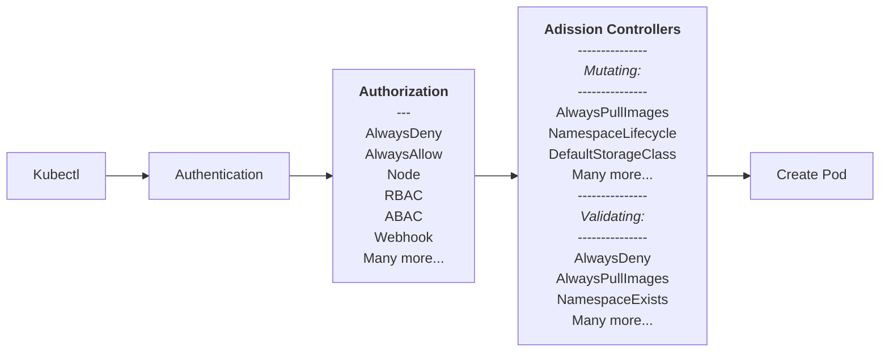

## Authorization
In Kubernetes, authorization is a crucial aspect of cluster security that controls what actions users, processes, or services are allowed to perform within the cluster. Kubernetes supports several authorization modes to meet various security requirements. These authorization modes help enforce access control policies and ensure that only authorized entities can interact with the cluster's resources. Here are some of the different authorization modes in Kubernetes:

1. **AlwaysDeny**: This is the most restrictive authorization mode. When enabled, it denies all requests to the Kubernetes API server, regardless of the user's identity or request type. This mode is useful for scenarios where you want to lock down the cluster completely.

2. **AlwaysAllow**: As the name suggests, this mode allows all requests to the API server without any restrictions. It is primarily used for debugging and should not be used in production environments due to its lack of access control.

3. **Node**: Node authorization mode allows kubelets (the agents running on each node) to perform actions on the API server on behalf of nodes. This is essential for operations like creating and deleting pods on nodes.

4. **RBAC (Role-Based Access Control)**: RBAC is one of the most commonly used authorization modes in Kubernetes. It allows cluster administrators to define granular access control policies using roles, role bindings, and cluster roles. RBAC is a flexible and powerful way to control who can perform actions on Kubernetes resources based on their identity and role.

5. **Webhook**: Webhook authorization enables you to delegate authorization decisions to an external HTTP service. When a user or service makes a request to the Kubernetes API server, the server sends an authorization request to the webhook service. The webhook service then decides whether to allow or deny the request based on custom policies.

6. **ABAC (Attribute-Based Access Control)**: ABAC is an older authorization mode in Kubernetes that is being deprecated in favor of RBAC. ABAC uses a static policy file to determine access control based on attributes of the user and the resource being accessed. While it provides flexibility, it can be challenging to manage and is less expressive than RBAC.

7. **NodeRestriction**: NodeRestriction is a security feature introduced to limit the use of the `kubectl proxy` and `kubectl port-forward` commands to access nodes. It restricts access to these commands only to users who are cluster administrators or explicitly authorized.

8. **PodSecurity admission controller**: This is not a standalone authorization mode but a way to enforce security policies for pods. It can restrict pods from running with certain privileges or capabilities, enhancing security by preventing pods from performing potentially harmful actions.

9. **Attribute-Based Access Control (ABAC)**: ABAC is an older authorization mode in Kubernetes. It grants or denies access to resources based on user attributes and resource labels defined in a static policy file. However, ABAC is less flexible and more complex to manage compared to RBAC, so it is being phased out in favor of RBAC.

10. **Custom Authorization Modes**: Kubernetes also allows you to implement custom authorization modes by developing custom admission controllers or plugging in external authorization systems, such as LDAP or OAuth2, to meet specific organizational requirements.

## Can I?

`kubectl auth can-i` is a powerful tool to determine whether a user, group, or service account has permissions to perform specific actions on Kubernetes resources.

Check if a User Can Perform an Action in a Namespace
```bash
kubectl auth can-i <verb> <resource> --namespace=<namespace> --as <user>
kubectl auth can-i get pods --namespace=my-namespace --as john
```

Check if a User Can Perform an Action on a Cluster-Wide Resource
```bash
kubectl auth can-i <verb> <resource> --as <user>
kubectl auth can-i get nodes --as admin
```

Check if a Service Account Can Perform an Action in a Namespace
```bash
kubectl auth can-i <verb> <resource> --namespace=<namespace> --as=system:serviceaccount:<namespace>:<service-account-name>
kubectl auth can-i create pods --namespace=my-namespace --as=system:serviceaccount:my-namespace:my-serviceaccount
```

Check if a Group Can Perform an Action in a Namespace
```bash
kubectl auth can-i <verb> <resource> --namespace=<namespace> --as=group:<group-name>
kubectl auth can-i list services --namespace=my-namespace --as=group:developers
```

Check if a User Can Perform an Action on a Specific Resource in a Namespace
```bash
kubectl auth can-i <verb> <resource>/<resource-name> --namespace=<namespace> --as <user>
kubectl auth can-i delete configmap/my-configmap --namespace=my-namespace --as alice
```

Check if a User Can Perform an Action on a Resource Using a Specific RoleBinding
```bash
kubectl auth can-i <verb> <resource>/<resource-name> --namespace=<namespace> --as <user> --all-namespaces
kubectl auth can-i update deployment/my-deployment --namespace=my-namespace --as bob --all-namespaces
```

By using `kubectl auth can-i`, you can quickly verify and troubleshoot RBAC policies in your Kubernetes cluster to ensure proper access control.
