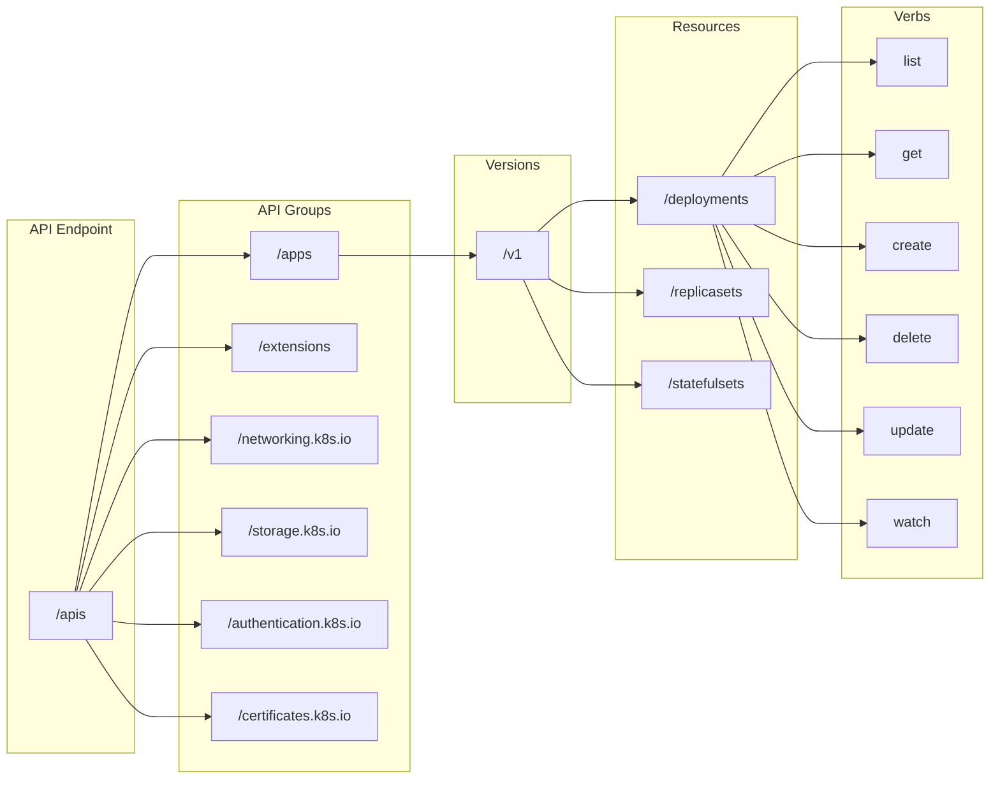

In Kubernetes, the API is organized into several concepts, including API groups, resources, and verbs, to enable interaction with the cluster's resources. These concepts help users and applications perform operations on Kubernetes objects. Here's an overview of each concept:

1. **API Groups**:

   An API group is a collection of related resources and their endpoints in the Kubernetes API. API groups allow Kubernetes to extend its core functionality without cluttering the main API. Each API group typically corresponds to a specific feature or subsystem in Kubernetes.

   Common API groups include:
   - `core`: The core API group containing basic resources like pods, services, and namespaces. It's often referred to as the "core" or "v1" group.
   - `apps`: Contains resources for deploying and managing applications, such as Deployments, StatefulSets, and DaemonSets.
   - `batch`: Includes resources for scheduling and running batch jobs, like CronJobs.
   - `extensions`: Previously used for various extensions to Kubernetes, but many of its resources have been moved to other API groups.
   - Custom API groups: Kubernetes allows users to define their custom resources and create custom API groups for them. These are often used for extending Kubernetes with custom objects.

2. **Resources**:

   Resources represent objects in a Kubernetes cluster that you can create, read, update, or delete. Each API group defines its own set of resources. Resources have both a singular and plural form, e.g., `pod` (singular) and `pods` (plural).

   Common Kubernetes resources include:
   - `Pods`: The smallest deployable units in Kubernetes.
   - `Services`: Provide network access to pods.
   - `Deployments`: Define desired pod state and allow for scaling and rolling updates.
   - `ConfigMaps` and `Secrets`: Store configuration data and sensitive information.
   - `Namespaces`: Logical partitions within a cluster.
   - Custom resources: You can define custom resources in custom API groups for your specific use cases.

3. **Verbs**:

   Verbs are the actions you can perform on resources. Kubernetes defines a standard set of verbs for interacting with resources. The common verbs include:

   - `get`: Retrieve information about a resource.
   - `list`: List multiple resources of the same type.
   - `create`: Create a new resource.
   - `update`: Modify an existing resource.
   - `delete`: Remove a resource.
   - `patch`: Partially update a resource.
   - `watch`: Monitor resource changes in real-time.
   - Custom verbs: Custom resources and API groups can define their own verbs specific to their use cases.

   For example, you can use the following `kubectl` commands to perform various actions with resources:
   - `kubectl get pods`: Get information about pods.
   - `kubectl create deployment`: Create a new deployment.
   - `kubectl delete service`: Delete a service.
   - `kubectl patch configmap`: Partially update a ConfigMap.


## Calling the API
Getting the API endpoint
```bash
KUBE_API=$(kubectl config view -o jsonpath='{.clusters[0].cluster.server}')
```

Calling the Kubernetes api
```sh
curl -k $KUBE_API/version
{
  "major": "1",
  "minor": "25",
  "gitVersion": "v1.25.2",
  "gitCommit": "5835544ca568b757a8ecae5c153f317e5736700e",
  "gitTreeState": "clean",
  "buildDate": "2022-09-21T14:27:13Z",
  "goVersion": "go1.19.1",
  "compiler": "gc",
  "platform": "linux/arm64"
}
```
The -k flag is used to allow insecure connections when accessing the API server because it's usually self-signed. But if you call the apis endpoint you might get the following error:

View the api groups
```sh
curl --cacert ca.crt --cert client.crt --key client.key $KUBE_API
```

View the resource groups
```sh
curl --cacert ca.crt --cert client.crt --key client.key $KUBE_API/apis | grep name
```

if we don't provide the certificates, we might encouter `forbidden: User 'system:anonymous' cannot get path '/apis'` error message, this indicates that the curl request is being treated as an anonymous request without proper authentication. By default, the Kubernetes API server requires authentication to access its endpoints. 

```sh
curl -k $KUBE_API/apis
{
  "kind": "Status",
  "apiVersion": "v1",
  "metadata": {},
  "status": "Failure",
  "message": "forbidden: User \"system:anonymous\" cannot get path \"/apis\"",
  "reason": "Forbidden",
  "details": {},
  "code": 403
}
```

To authenticate your request, you need to pass the authentication credentials with your curl command. Here's an example using a kubeconfig file:
```sh
curl --cacert ca.crt --cert client.crt --key client.key $KUBE_API/apis
```

You can use the `config` command to view the file paths for certificates:
```sh
kubectl config view
```

If your kubeconfig file contains `DATA+OMITTED` instead of the actual file paths for certificates, it means that the kubeconfig has embedded the certificate data directly instead of referencing the files by their paths. In this case, you'll need to extract the certificate data from the kubeconfig and save it to separate files. Here's how you can do it:

## Extract certificate from the kubernetes config
### Extract the Cluster Certificate Authorithy
```sh
kubectl config view --minify --raw --output 'jsonpath={..cluster.certificate-authority-data}' | base64 -d | openssl x509 -text -out - > ca.crt
```

### Extract the Client Certificate
```sh
kubectl config view --minify --raw --output 'jsonpath={..user.client-certificate-data}' | base64 -d | openssl x509 -text -out - > client.crt
```

### Extract the Client Private Key
```sh
kubectl config view --minify --raw --output 'jsonpath={..user.client-key-data}' | base64 -d > client.key
```

## Using `kubectl proxy`
kubectl proxy is a command in Kubernetes that creates a proxy server between your local machine and a Kubernetes API server running in a cluster. This proxy server allows you to access the Kubernetes API server without exposing it directly to your local network or the public internet. It's a useful tool for securely accessing and interacting with the Kubernetes API server. Keep in mind that `kubectl proxy ≠ kube proxy`.

To use `kubectl proxy` to call API endpoints in a Kubernetes cluster, follow these steps:

1. **Start the `kubectl proxy`**:

   Open a terminal window and run the following command to start the `kubectl proxy`:

   ```bash
   kubectl proxy
   ```

   By default, this will start the proxy on `localhost` at port 8001. You should see a message indicating that the proxy is running.

2. **Access API Endpoints**:

   Once the proxy is running, you can access various Kubernetes API endpoints by making HTTP requests to `http://localhost:8001` (or the port where the proxy is running) using your preferred tool, such as `curl` or a web browser.

   Here are some examples of how to access different API endpoints:

   - **Get the Kubernetes API version**:
     ```bash
     curl http://localhost:8001/version
     ```

   - **List all pods in the default namespace**:
     ```bash
     curl http://localhost:8001/api/v1/pods
     ```

   - **Access a specific pod by name**:
     ```bash
     curl http://localhost:8001/api/v1/namespaces/<namespace-name>/pods/<pod-name>
     ```

   - **Access a custom resource** (e.g., a CustomResourceDefinition called `myresources`):
     ```bash
     curl http://localhost:8001/apis/mygroup.example.com/v1/myresources
     ```

   Replace `<namespace-name>`, `<pod-name>`, `<group-name>`, and other placeholders with the actual values relevant to your Kubernetes cluster and resources.

3. **Authentication**:

   The authentication for these API requests is determined by your `kubectl` configuration (`kubeconfig`). Ensure that you have the necessary permissions and credentials configured in your `kubeconfig` to access the desired resources.

4. **Access Kubernetes Dashboards and UIs**:

   Some Kubernetes web UIs, such as the Kubernetes Dashboard, can be accessed via `kubectl proxy`. You can access them by visiting the appropriate URL in your web browser, typically `http://localhost:8001/ui` or `http://localhost:8001/api/v1/namespaces/kube-system/services/https:kubernetes-dashboard:/proxy/`.

Remember to adjust the URLs and paths based on your specific use case and resource requirements. `kubectl proxy` provides a convenient way to interact with the Kubernetes API server and resources locally, which is particularly useful for development, debugging, and exploration of the Kubernetes API.